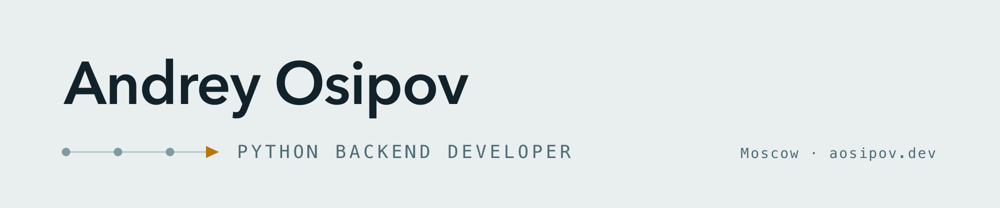
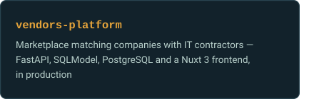
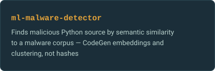
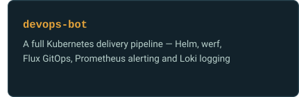
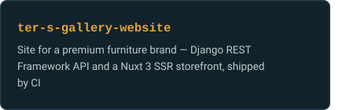
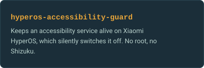
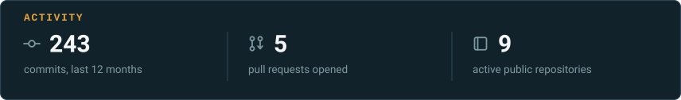

<picture>
  <source media="(prefers-color-scheme: dark)" srcset="assets/banner-dark.png">
  
</picture>

- 🐍 Backend developer — FastAPI, Django, PostgreSQL, and the Docker and CI that ship them
- 🏗 Building [VendorFind](https://vendorfind.ru), a marketplace matching companies with IT contractors
- 🔐 Founder of [ZanityVPN](https://cabinet.zanity.net)
- 🤝 Contributing to the [Remnawave](https://github.com/BEDOLAGA-DEV) ecosystem
- 📄 CV and portfolio at [aosipov.dev](https://aosipov.dev)

### Stack

### Selected work

### Contact

[aosipov.dev](https://aosipov.dev) · [a.osipov.code@gmail.com](mailto:a.osipov.code@gmail.com)
